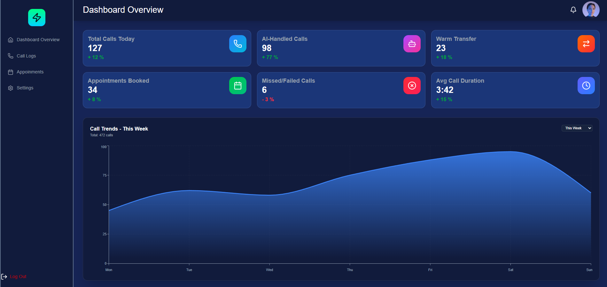

# 🛠️ UBreakiFix.Net - Device Repair Management System

[](https://u-breaki-fix-net.vercel.app)
[](https://reactjs.org/)
[](https://tailwindcss.com/)

**UBreakiFix.Net** is a modern, high-performance web application designed for device repair stores to manage customer bookings, track repair statuses, and maintain client profiles. It features a sleek, dark-themed dashboard built for speed and responsiveness.

🔗 **Live Demo:** [https://u-breaki-fix-net.vercel.app](https://u-breaki-fix-net.vercel.app)

---

### 📸 Image Upload & Preview Logic


## ✨ Features

- **Repair Dashboard:** A comprehensive view of all current and past repair bookings with advanced pagination.
- **Booking System:** Easily generate and share booking links with clients.
- **Client Management:** Store and view client contact details, device types, and repair history.
- **Dynamic Profile Management:** Interactive profile section with real-time editing and image upload previews.
- **Responsive Design:** Optimized for mobile, tablet, and desktop views using Tailwind CSS.
- **Modern UI/UX:** Dark-themed interface with custom scrollbars, glassmorphism effects, and Lucide icons.

---

## 🚀 Tech Stack

- **Frontend:** React.js
- **Styling:** Tailwind CSS
- **Icons:** Lucide-React
- **Form Handling:** React Hook Form
- **Routing:** React Router
- **State Management:** Context API
- **Deployment:** Vercel

---

## 📂 Project Structure

```text
UBreakiFix!/
├── public/                 # Static assets (Images, Logos, Icons)
│   ├── AI.png
│   ├── Profile.png
│   └── Logo.png
├── src/
│   ├── assets/             # Global static files
│   ├── components/         # Reusable UI components organized by feature
│   │   ├── Appoinments/
│   │   ├── CallLogs/
│   │   ├── Dashboard/
│   │   ├── Settings/
│   │   └── common/         # Shared components (Field, Button, etc.)
│   ├── context/            # React Context definitions
│   ├── hooks/              # Custom React hooks (useProfile)
│   ├── Pages/              # Main route components/views
│   ├── PrivateRoutes/      # Route guards and protection logic
│   ├── Provider/           # Context Providers (ProfileProvider)
│   ├── utils/              # Helper functions and mock data
│   ├── App.jsx             # Main application component & routing
│   └── main.jsx            # Application entry point
├── vercel.json             # Vercel deployment configuration
└── vite.config.js          # Vite build and dev server configuration

```

## 🛠️ Installation & Setup

Follow these steps to run the project locally:

1. **Clone the repository:**
   ```bash
   git clone (https://github.com/peyalhasan/UBreakiFix.Net.git)
   cd UBreakiFix.Net